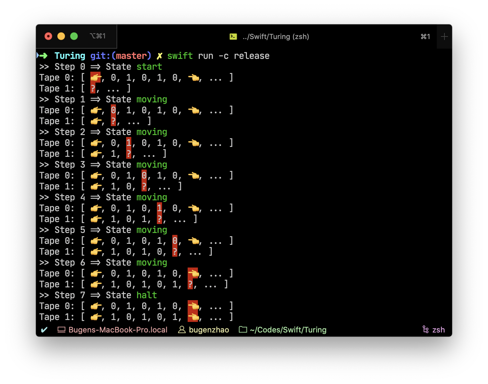

# Turing

A Turing Machine in Swift.

## Get Started

```swift
import TuringLib

enum Symbol: String, CustomStringConvertible {
    case 👉, 👈
    case rei = "0", ichi = "1"
    var description: String { return rawValue }
}

enum State {
    case start, halt, moving
}

let machine = TuringMachine<State, Symbol>(tapeCount: 1, initialState: .start)
let instructions: [Instruction<State, Symbol>] = [
    Instruction(.start, [.👉], .moving, [.👉], [.R]),
    Instruction(.moving, [.ichi], .moving, [.rei], [.R]),
    Instruction(.moving, [.rei], .moving, [.ichi], [.R]),
    Instruction(.moving, [.👈], .halt, [.👈], [.S]),
]
let tape: [Symbol] = [.👉, .rei, .ichi, .rei, .ichi, .rei, .ichi, .rei, .ichi, .👈]

try! machine.addInstruction(from: instructions)
machine.tapes[0].tape = tape


machine.run()
```


